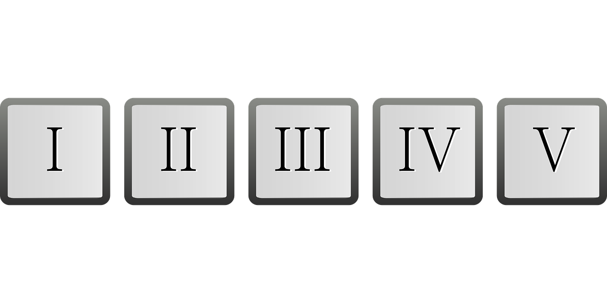

# Roman Numerals Converter

## Description

Available [here](http://codingdojo.org/kata/RomanNumerals/)

### Simple Examples

| Arabic | Roman | Arabic | Roman | Arabic | Roman | Arabic | Roman |
| --- | --- | --- | --- | --- | --- | --- | --- |
| 1 | I | 10 | X | 100 | C | 1000 | M |
| 2 | II | 20 | XX | 200 | CC | 2000 | MM |
| 3 | III | 30 | XXX | 300 | CCC | 3000 | MMM |
| 4 | IV | 40 | XL | 400 | CD | 4000 | MMMM |
| 5 | V | 50 | L | 500 | D |
| 6 | VI | 60 | LX | 600 | DC |
| 7 | VII | 70 | LXX | 700 | DCC |
| 8 | VIII | 80 | LXXX | 800 | DCCC |
| 9 | IX | 90 | XC | 900 | CM |

### More Examples, with Decomposition

| Arabic | Roman | Decomposition |
| ------ | ----- | ------------- |
| 1990 | MCMXC | 1000(M)  + 900(CM) + 90(XC) |
| 2008 | MMVIII | 2000(MM) + 8(VIII) |
| 99 | XCIX | 90(XC) + 9(IX) |
| 47 | XLVII | 40(XL) + 7(VII) |

## Session Quick Retrospective

You can fill it from [here](./QuickRetrospective.md)

## Useful Links

### For this Kata

- [Online roman decimal converter](https://www.calculateme.com/roman-numerals/to-roman)
- [Another one](https://www.calculator.org/calculate-online/mathematics/roman-numerals.html)
- [One more](https://goodcalculators.com/roman-numeral-converter/)

### General

- Handy for any type of turn-based session: [Online Timer](https://agility.jahed.dev/)

## Session Information

### Style & Duration

- 2-hour [Randori in Pairs](./doc/RandoriInPairs.md)

### Topic

Basic TDD & Pair Programming

### Focus Points

- Red-Green-Refactor
- Baby Steps
- YAGNI

### Source Files

## License

The `Kata-RomanNumeralsConverter` and the accompanying materials are made available
under the terms of the MIT License ([here](LICENSE.md)) which accompanies this
distribution, and is available at the Open Source site [here](https://opensource.org/licenses/MIT)

## Acknowledgements

See [ACKNOWLEDGEMENTS.md](./ACKNOWLEDGEMENTS.md) for more information.